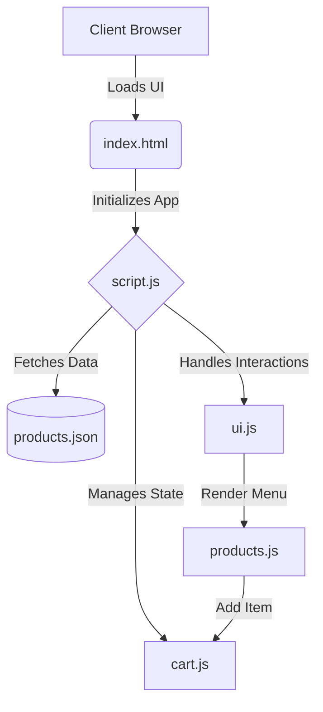

# 🍕 Foodie: Premium Food Delivery Experience

> 🎥 **Video Demonstration**
> [Click here to watch the full project walkthrough](https://drive.google.com/file/d/12FY3YIHaAQ6KReLDRQaF0ildY79naFXG/view?usp=sharing)

---

## 🛡️ Privacy & Performance Disclosure
> As a client-first application, Foodie is built with a strong emphasis on performance and user privacy.
> 
> * **Zero Back-End Tracking**: All interactions, including shopping cart state and preferences, are managed client-side. No user data is collected or sent to external servers.
> * **Lightning Fast Delivery**: Foodie eliminates heavy frameworks, relying on vanilla ES6 JavaScript to ensure sub-second Time to Interactive (TTI).
> * **Decoupled Architecture**: Designed with a pure JSON data contract (`products.json`), making it instantly ready to integrate with any headless CMS or API backend in the future.

---

## 🗺️ 1. High-Level Overview (The "50,000-Foot" View)

### 🎯 Define the Goal
**Foodie** is an elegant, highly responsive food delivery web application that solves the friction of online food ordering. Its primary purpose is to provide a seamless, tantalizing user experience for hungry customers, enabling them to browse, select, and purchase meals with zero friction. It is designed for:
- **Customers** seeking quick, accessible, and visually appealing menus.
- **Restaurant Owners** wanting a beautiful, conversion-optimized storefront.

### 🍽️ The "Restaurant" Analogy
To understand the architecture without reading code, think of it as a physical restaurant:
- **The Dining Area (Frontend):** (`index.html`, `style.css`) The beautifully decorated environment where the customer sits. It handles the visual presentation and makes the food look irresistible.
- **The Waitstaff (Interactions):** (`ui.js`, `cart.js`) The waitstaff observes your actions, takes your order (*"Add to cart"*), calculates your bill, and ensures a smooth dining experience.
- **The Kitchen & Menu (Data & Logic):** (`products.js`, `products.json`) The kitchen securely stores recipes and ingredients. When the waitstaff asks for the menu, the kitchen rapidly serves it up.

### 📐 System Architecture


---

## 📸 2. Project Showcase & Interface

An immersive experience starts with compelling visuals. Here is a look at the Foodie UI:

| Hero Section | Menu & Ordering |
|:---:|:---:|
|  |  |
| *Clean hero section with a bold call-to-action.* | *Dynamic menu with seamless cart integration.* |

| Services Highlight | Newsletter Subscription |
|:---:|:---:|
|  |  |
| *Clear value propositions for the user.* | *Lead generation and user retention.* |

---

## 👥 3. Tailored to the Audience

### 👔 For Non-Technical Stakeholders & Managers
This project is engineered to maximize **User Conversion & Retention**:
- **Zero-Friction Browsing:** A snappy, single-page-like experience means customers find food faster, leading to higher order volume.
- **Business Value:** The modular structure allows instant menu updates (just tweak a JSON file), minimizing developer bottleneck and saving operational costs.
- **Cross-Platform:** Mobile-first design guarantees that customers ordering from their smartphones get the exact premium experience as desktop users.

### 💻 For Developers & Technical Peers
The architecture emphasizes **Modularity & Maintainability**:
- **Data Flow:** Data operates in a strictly unidirectional flow from `products.json` -> `products.js` -> DOM.
- **API Contracts:** Native `fetch()` wrappers are used to decouple static JSON from the frontend, ensuring we can hot-swap `products.json` for an Express/Node.js API endpoint seamlessly in the future.
- **Architectural Decisions ("Why?"):** Vanilla ES6 Modules were chosen over React/Vue to eliminate dependency bloat, maximize initial load speeds (LCP), and maintain tight control over the DOM layout.

---

## 🔍 4. Structured Code Walkthrough

### 🚪 Start at the Entry Point
The application boots up via `script.js`. This is our "Main Controller" that orchestrates the entire application lifecycle:
```javascript
document.addEventListener("DOMContentLoaded", () => {
  productDataFetch();      // Hydrates the DOM with Menu Items
  initUI();                // Binds event listeners
  initCheckout();          // Initializes the shopping cart state
  initNewsletter();        // Sets up newsletter form logic
});
```

### 🔗 The "Chain of Actions" (Adding to Cart)
*What happens when a user clicks the "Add to Cart" button?*
1. **Interaction Detect:** An event listener in `products.js` captures the click based on the product's unique `id`.
2. **State Mutation:** The item payload is passed to `cart.js` (`addToCart(product)`), which checks if the item already exists to prevent duplicate entries, and pushes it to the `cartProduct` array.
3. **UI Sync:** The DOM is immediately re-rendered (`updateUI()`) to visually validate the user's action without a page refresh, updating the Cart Badge and Subtotal.

### 🗄️ Highlight Key Data Models
Our core data structure lives in `products.json`:
```json
{
  "id": 1,
  "name": "Double chicken Burger",
  "price": "₹802",
  "image": "images/burger.png"
}
```
This acts as our single source of truth. The application dynamic rendering engine consumes this schema, mapping it to HTML components.

---

## 🎮 5. Interactive and Visual Techniques

### 🐞 Live Debugging & Demo
To see the application pulse in real-time:
1. Open the app in your browser and press `F12` to access Developer Tools.
2. Navigate to the **Sources** tab.
3. Open `cart.js` and set a **Breakpoint** inside the `addToCart` function.
4. Click "Add to Cart" on the website.
5. Watch the `cartProduct` array mutate in real-time as variables shift dynamically.

### ⚙️ Utilize IDE Features
To navigate this codebase efficiently:
- Right-click on methods like `initUI()` and use **"Go to Definition"** (F12 in VS Code) to jump to the logic implementation.
- Use **"Find All References"** on the `products.json` file to instantly see how the frontend parses backend data.

---

## 🎨 6. Design System & Tech Stack

Foodie is built with a warm, conversion-optimized color palette to stimulate appetite and create a premium feel.

```css
:root {
    --lead: #212121;           /* Premium dark gray for strong typography */
    --gold-finger: #f2BD12;    /* Primary accent color for maximum CTA visibility */
    --eye-ball: #fffdf7;       /* Soft cream background to reduce eye strain */
    --hint-yellow: #fcf1cc;    /* Subtle highlight for active states */
    --pure-white: #fff;        /* Crisp white for content cards */
}
```

### 🛠️ Core Technologies
- **HTML5 & CSS3:** Semantic structure with flexbox/grid layouts and CSS variables.
- **Vanilla JavaScript (ES6+):** Module-based architecture (no heavy frameworks).
- **Swiper.js:** For smooth, touch-friendly carousel interactions.
- **Font Awesome:** Scalable vector icons for clean UI elements.

---

## 🚀 7. End-to-End Installation Guide

### 🟢 For Non-Technical Users
1. **Download the File:** Click the green `Code` button at the top right of this page and select **Download ZIP**.
2. **Unzip the Folder:** Locate the downloaded file on your computer, right-click, and select "Extract All...".
3. **Open the Website:** Open the extracted folder, find the file named `index.html`, and simply double-click it. It will open securely in your default web browser (Chrome, Edge, Safari). You can now explore the app!

### 💻 For Technical Users
To run the full development environment:
1. **Clone the Repo:**
   ```bash
   git clone https://github.com/YOUR_USERNAME/food-delivery-website.git
   ```
2. **Navigate to the Directory:**
   ```bash
   cd food-delivery-website
   ```
3. **Launch the Local Dev Server:**
   * If you are using VS Code, use the [Live Server Extension](https://marketplace.visualstudio.com/items?itemName=ritwickdey.LiveServer). Right-click `index.html` -> **"Open with Live Server"**.
   * Alternatively, use Node or Python:
     ```bash
     npx serve .
     # OR
     python3 -m http.server 8000
     ```
4. **Access the Application:** Open your browser to `http://localhost:8000` (or the port defined by Live Server).

---

## 📄 License
This project is open-sourced under the **MIT License**. You are free to use, modify, distribute, and build upon this code for both personal and commercial use. 

*Made with ❤️ by a Fresher Developer.*
